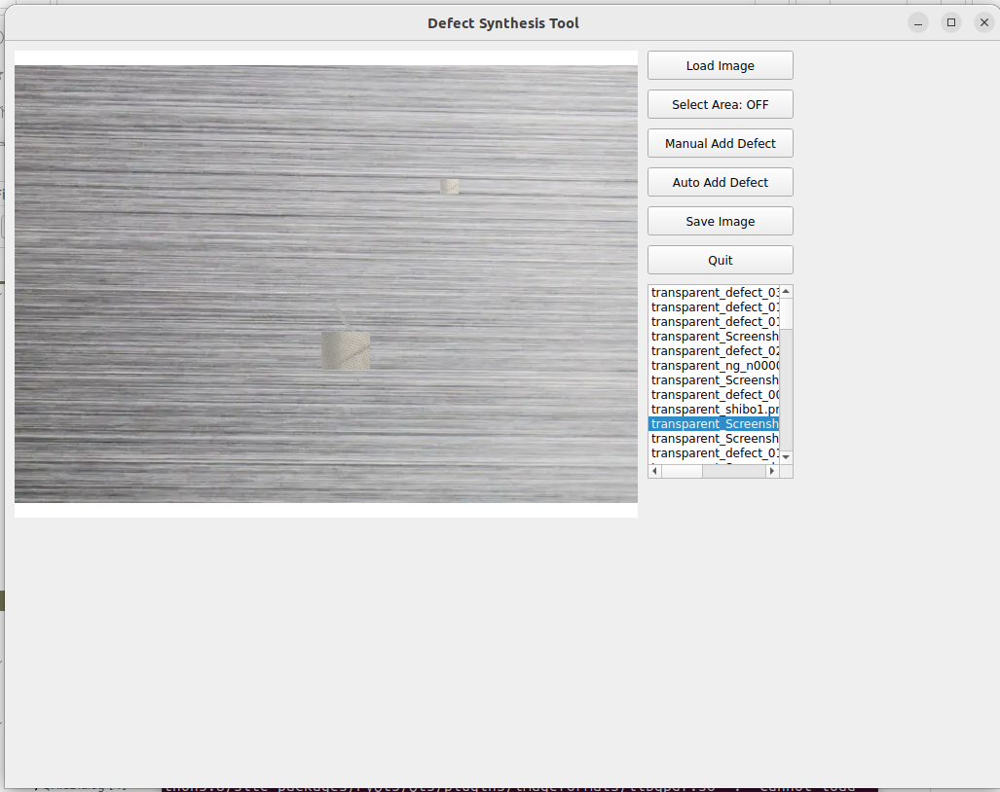
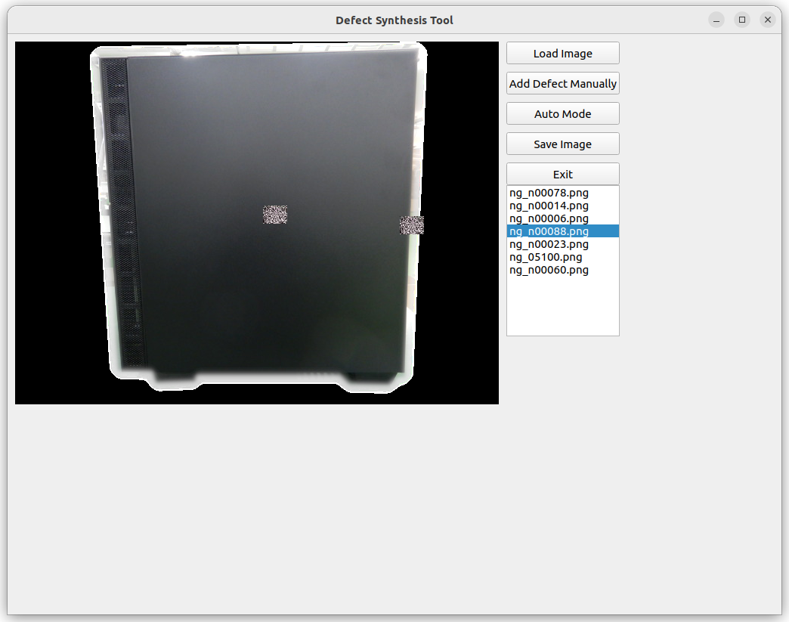

# defectcreator
**generate defecttive  sample images**
## Update
1. 27th Nov 2024
   - Scratch creating function
   - Improve Select area mode(stamp the failure sampele images

# Feature
- generate defect sample from acceptable image
- stamp the defective which you want to add.
- If you want to use new function, please select creating defect area.

```
defectcreator$ tree -d
.
├── defects

```



## necessary modules for execute
- PyQt5
- random
- sys
- os

## Directory
root(py file set here)
|--defects : put defective samples here


# Instruction

```
python abnocreator.py

```
- GUI menu launch

## GUI menu  
- Left window is Image display. It is main window.
- right side is load/save image button and manually/Random stamp defective image button.



## It is still on the way developping version. I need people who is expand function.


# LCD inspection sample generator
Please check LCD sub directory. thanks!
